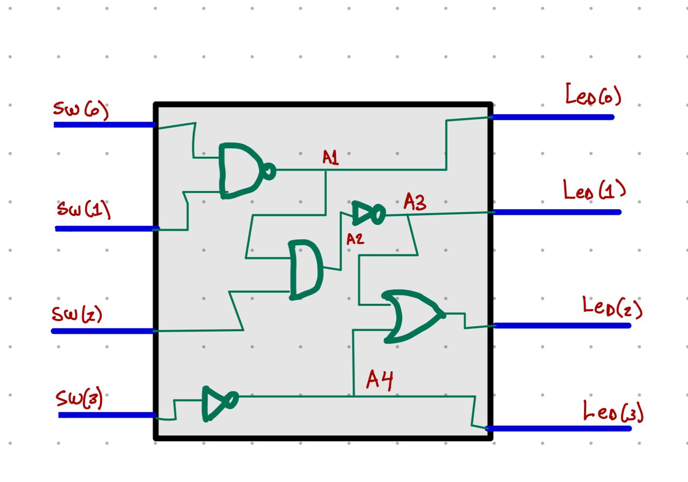

# ModelSim_FPGA
FPGA Projects

Here ar my projects:
First I wanted to create a logics thata test every situation.

My first attempt uses invidual file defitions for creating the main file. Also I produce the Testbench
for testing every posibiltiy.

